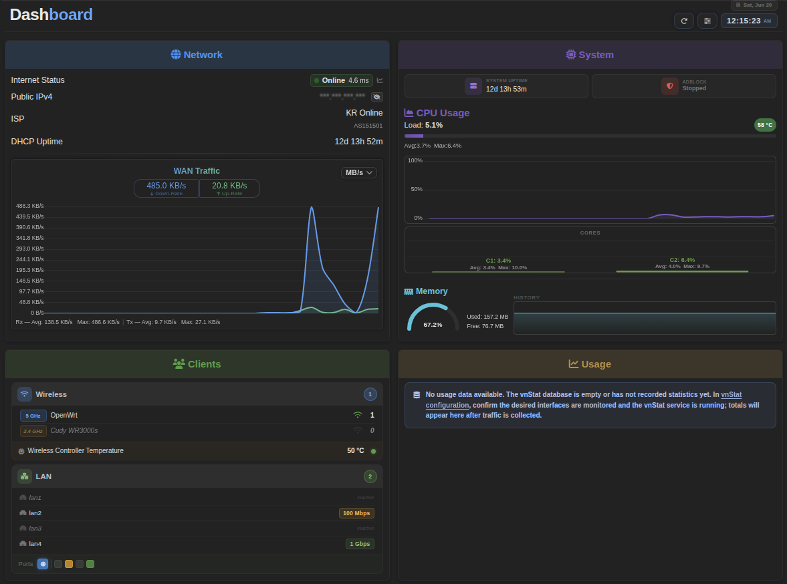

# LuCI Realtime Dashboard

Real-time system monitoring dashboard and vnStat database backup manager for OpenWrt. Renders live charts and stats inside the LuCI web UI. No external services or build tools required.

---

## Installation

### For OpenWrt v25.12 or newer (.apk)

```bash
wget --no-check-certificate -O /tmp/luci-app-dashboard.apk "https://github.com/OppsError404/luci-app-dashboard/releases/download/v1.0.0-r5/luci-app-dashboard-1.0.0-r5.apk" && \
apk add --allow-untrusted /tmp/luci-app-dashboard.apk && \
rm -f /tmp/luci-app-dashboard.apk
```

### For OpenWrt v24.10.5 or older (.ipk)

```bash
wget --no-check-certificate -O /tmp/luci-app-dashboard.ipk "https://github.com/OppsError404/luci-app-dashboard/releases/download/v1.0.0-r5/luci-app-dashboard_1.0.0-r5.ipk" && \
opkg install /tmp/luci-app-dashboard.ipk && \
rm -f /tmp/luci-app-dashboard.ipk
```

## Uninstallation

### For OpenWrt v25.12 or newer (.apk)

```bash
apk del luci-app-dashboard
```

### For OpenWrt v24.10.5 or older (.ipk)

```bash
opkg remove luci-app-dashboard
```

## Features

### Dashboard

- WAN RX/TX live rates with rolling chart
- Internet ping status and RTT
- PPPoE / DHCP / Static WAN detection and uptime
- Public IP, ISP name, ASN (12h cache)
- CPU usage — overall + per-core bars + line chart
- CPU and Wi-Fi chip temperatures
- RAM arc gauge, bar, and sparkline chart
- System uptime
- vnStat daily and monthly traffic totals (optional)
- Adblock domain count and status (optional)

### vnStat Backup

- Automated 12-hour scheduled backups to persistent flash storage
- Instant backup/restore via web UI or CLI
- Compressed gzip storage to minimize flash wear
- Persistent timestamp tracking across reboots
- Global CLI commands: `vnstat_backup` and `vnstat_restore`

---

## Usage

### Web Interface

Navigate to **Services → Dashboard** in the LuCI menu.

### Service Commands

```bash
/etc/init.d/dashboard status                  # Show full service status
/etc/init.d/dashboard vnstat_enable           # Enable vnStat card
/etc/init.d/dashboard vnstat_disable          # Disable vnStat card
/etc/init.d/dashboard adblock_enable          # Enable Adblock card
/etc/init.d/dashboard adblock_disable         # Disable Adblock card
/etc/init.d/dashboard vnstat_backup_enable    # Enable scheduled 12h DB backup
/etc/init.d/dashboard vnstat_backup_disable   # Final backup then disable
/etc/init.d/dashboard vnstat_backup_fix       # Repair missing cron job
/etc/init.d/dashboard vnstat_backup           # Immediate backup
/etc/init.d/dashboard vnstat_restore          # Immediate restore
```

### Global CLI Shims

```bash
vnstat_backup   # Same as /etc/init.d/dashboard vnstat_backup
vnstat_restore  # Same as /etc/init.d/dashboard vnstat_restore
```

---

## Configuration

Edit `/etc/config/dashboard`:

```
config dashboard 'settings'
    option vnstat   '1'     # Show vnStat traffic card (0/1)
    option adblock  '1'     # Show Adblock status card (0/1)
    option vnstat_db '0'    # Enable automatic vnStat DB backups (0/1)
```

Apply changes:

```bash
/etc/init.d/dashboard restart
```

---

## Dependencies

### Required

| Package | Required | Notes |
|---------|----------|-------|
| `luci-base` | Yes | LuCI framework |
| `lua` | Yes | Lua runtime |
| `luci-compat` | Yes | Compatibility layer |
| `curl` | Yes | HTTP client for IP/ISP lookups |
| `luci-lib-nixio` | Yes | Nixio library for filesystem operations |

### Optional

| Package | Required | Notes |
|---------|----------|-------|
| `vnstat2` | No | Enables traffic statistics |
| `adblock` | No | Enables adblock status card |

### Frontend (CDN)

- Chart.js 3.x
- Font Awesome 6.5

---

## URLs

```
/cgi-bin/luci/admin/services/dashboard
/cgi-bin/luci/admin/services/vnstat_backup
/cgi-bin/luci/admin/status/dashboard          (JSON API)
/cgi-bin/luci/admin/status/dashboard/force    (force cache clear)
```

---

## Notes

- vnstatd must be running for traffic stats to accumulate.
- vnStat DB backup requires vnstat2 to be installed and running.
- All cache files live in /tmp and reset on reboot.
- Backup files stored in /etc/vnstat/backup/ persist across reboots.

---

## Screenshots



## About

Real-time dashboard and vnStat database backup manager for OpenWrt LuCI.


### License

MIT License
